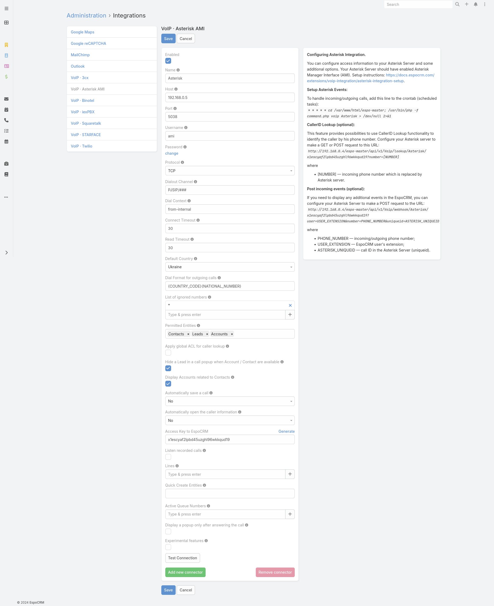
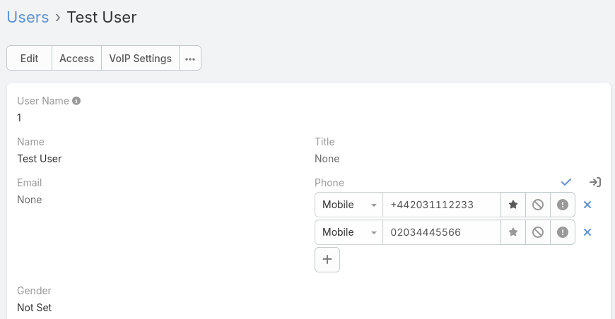

# Asterisk Integration Setup

Asterisk integration is available as part of [VoIP Integration extension](https://www.espocrm.com/extensions/voip-integration/). It allows to integrate EspoCRM with Asterisk server through Asterisk Manager Interface (AMI) and other VoIP providers, read more details [here](https://www.espocrm.com/features/asterisk-integration-setup/).

## Supported Asterisk servers

VoIP Integration extension supports* the following Asterisk servers:

* Asterisk 22
* Asterisk 21
* Asterisk 20
* Asterisk 19
* Asterisk 18
* Asterisk 17
* Asterisk 16
* Asterisk 15
* Asterisk 14
* Asterisk 13

\* these servers were tested with VoIP Integration extension.

## How to setup Asterisk Integration for an administrator

#### Step 1:
Fill in the connection details of your Asterisk server. To do this, go to the Administration (System panel) > VoIP · Asterisk AMI.



* **Name** – name of your connection.
* **Host** – IP or domain name of your Asterisk Server.
* **Port** – a port for connection through AMI interface.
* **Username** – AMI username.
* **Password** – AMI user password.
* **Protocol** – protocol for connection to Asterisk server (TCP, UDP, TLS).
* **Dialout Channel** – channel format for outgoing calls. It can be “PJSIP/###” (Asterisk 13+) or “SIP/###”, where ### is a user’s extension (internal number). The extension “###” will be substituted automatically depending on the user.
* **Dial Context** – context for dial actions.
* **Connect Timeout** – timeout for connection to Asterisk server.
* **Read Timeout** – timeout of read events from Asterisk server.
* **Default Country** – the country is used to format phone numbers.
* **Dial Format for outgoing calls** – a phone number format for outgoing (click-to-call) calls.
* **List of ignored numbers** – list of numbers which will be ignored. Popup window will not be displayed. Use numbers in the following formats: +14844608117 (full number match) or #4844608117# (regular expression).
* **Permitted Entities** – entities that will be displayed in popup window and will be used to identify a caller by his phone number.
* **Apply global ACL for caller lookup** – apply global ACL rules (Administration > Roles) for caller lookup. This information is displayed in the popup window. If unchecked, no ACL restrictions are used.
* **Hide a Lead** – Hide a Lead in a call popup when Account / Contact are available.
* **Display Accounts related to Contacts** – display only Accounts related to Contacts.
* **Automatically save a call** – Automatically save incoming/outgoing calls in the system without having to press "Save" button.
* **Automatically open the caller information** – automatically open the caller information for incoming/outgoing calls.
* **Access Key to EspoCRM** – an access key of EspoCRM to post data from Asterisk server.
* **Listen recorded calls** – possibility to listen recorded calls in EspoCRM.
* **Lines** – a prefix of phone numbers. E.g. UK phone number 702031112233 will be formatted like “7” – a line and “02031112233” – a phone number.
* **Quick Create Entities** – entities which can be created through the call popup window.
* **Active Queue Numbers** – a list of queue phone numbers which should be determined by EspoCRM.
* **Display a popup only after answering the call** – do not show incoming call popups until the user answers a call.
* **Experimental features** – test experimental features.

#### Step 2:

Setup a cron job (scheduled task) to handle Asterisk events (incoming/outgoing calls, hangup, etc.). It is very important to set it up to run every minute. The line that needs to be added is displayed in the right section of your Asterisk settings. For linux-based OS, it looks like:

```
* * * * * cd /var/www/html/espocrm; /usr/bin/php -f command.php voip Asterisk > /dev/null 2>&1
```

For docker containers, see [here](#setting-up-cron-for-docker-container).


## How to setup Asterisk Integration for users

Each user who wants to use Asterisk integration, should setup his access in the User’s Profile, under “VoIP Settings”. Usually, it’s the SIP credentials. Also, the user can change some VoIP settings on this window.


* **VoIP Server** – your current VoIP server.
* **Your user extension** – your internal user extension (SIP user) of the Asterisk server.
* **Your VoIP password** – your password of the Asterisk server.
* **Display call notifications** – an option to enable/disable incoming/outgoing call notifications.
* **Silent notifications** – mute notification sound.
* **Use internal click-to-call** – an option to enable/disable the internal click-to-call feature. It is a feature to make outgoing calls through Asterisk server. If the checkbox is unchecked, then an external application will handle “tel:” links.
* **User Dial Context** – Dial Context for a User. If it is empty, a Dial Context of a connector will be used.

## Access control for users

Make sure that your users have the access to the entity 'Calls'.

* [Grant access to Calls](customization.md#grant-access-to-calls)

## Additional phone numbers for users

Each user can add several additional phone numbers to handle incoming calls. They can be added in the User’s Profile.
Note: Additional phone numbers are used for incoming calls only. Outgoing calls will use the internal user extension.



* **Phone numbers formats:** +442031112233, 00442031112233, 02031112233.

## Setting up cron for Docker container

To display pop-up windows for calls and correct working of the Asterisk VoIP extension in the Docker instance, you need to insert an additional line into the crontab. More [here](docker-container.md#asterisk-crontab-line).
